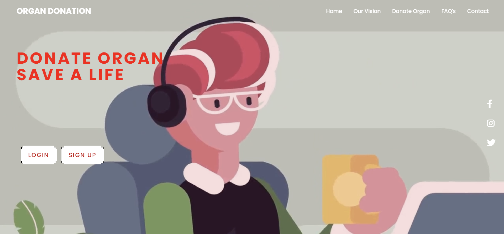
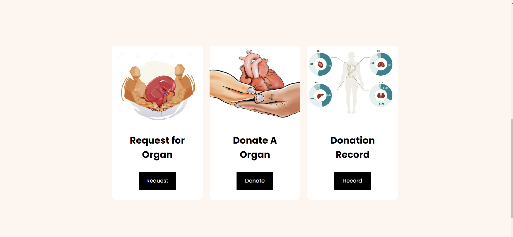
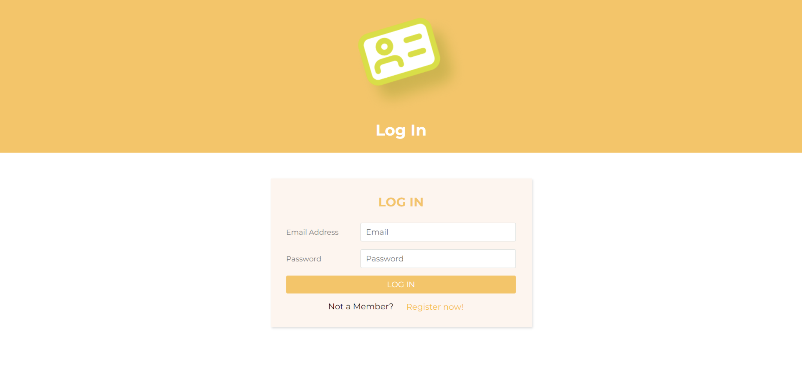

# Organ-Donation-Management-System

<h2>Introduction</h2>
Organ Donation is a modern management system that aims to connect hospitals and donors under the same shade. The system is designed to streamline the process of organ donation, making it easier for hospitals to find suitable donors and for donors to offer their organs to those in need. This full-stack website is built using PHP, JavaScript, MySQL, and Bootstrap, ensuring a user-friendly and responsive interface.

<h2>Features</h2>
c
  <li>Email Verification: The system implements email verification to ensure the authenticity of donors and hospitals, creating a secure and reliable platform.</li>
  <li>Session and Cookies: To enhance user experience and security, the system leverages the use of sessions and cookies to manage user data and preferences.</li>
  <li>Advanced Search Functionality: The platform provides advanced search functionality using filters to help hospitals find donors based on specific criteria such as 
     blood group, tissue compatibility, organ type, and affiliated hospital.</li>
  
  <li>Seamless CRUD Operations: Organ Donation offers seamless CRUD (Create, Read, Update, Delete) operations, enabling easy management of donor and hospital information. 
  </li>
  </ul>
<h2>Technology Used</h2>
<ul>
  <li>Front-end: HTML, CSS, Bootstrap, JavaScript, Jquery </li>
  <li>Back-end: PHP </li>
  <li>Database: MySQL</li>
 </ul>
<h2>Installation</h2>
1. Clone the repository: git clone  
2. Import the database schema using database.sql file.  
3. Configure the database connection in config.php.  
4. Deploy the project on a PHP-enabled web server.  

